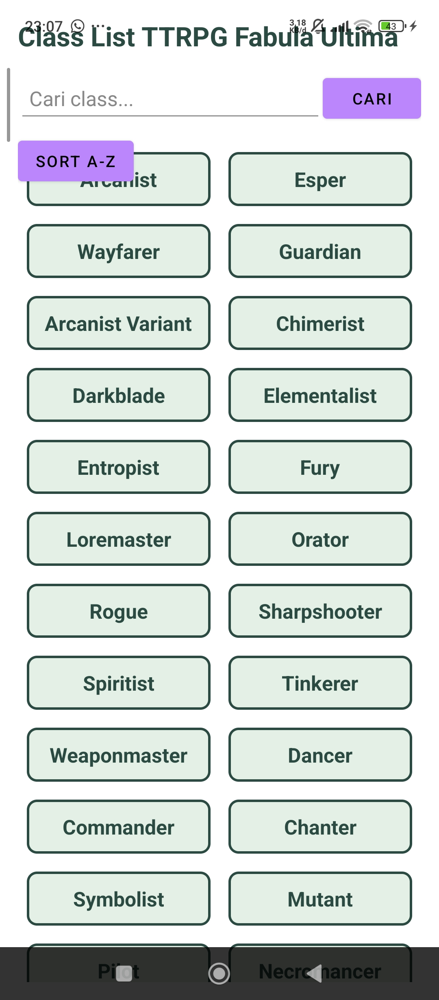
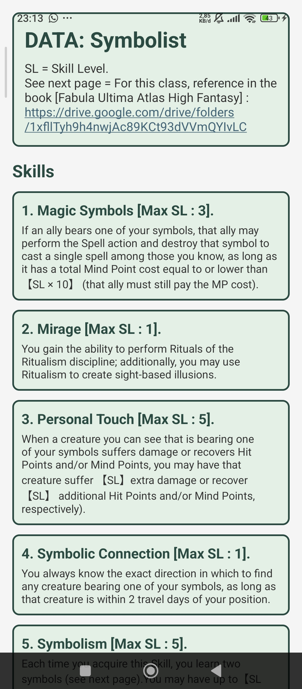
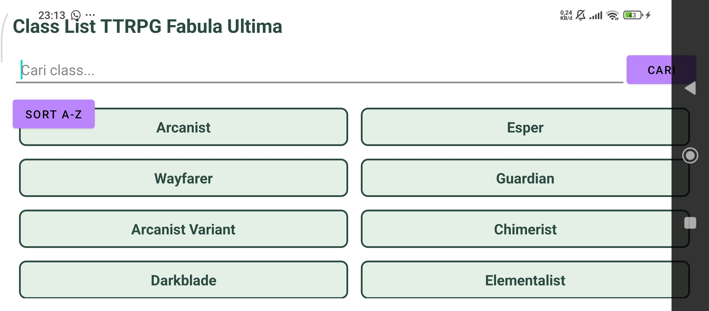
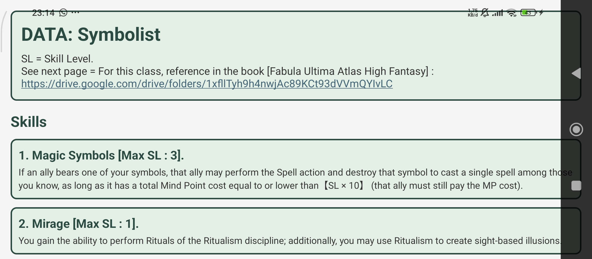
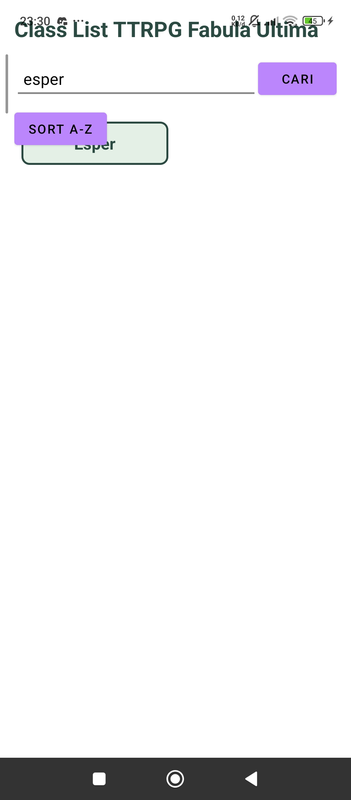
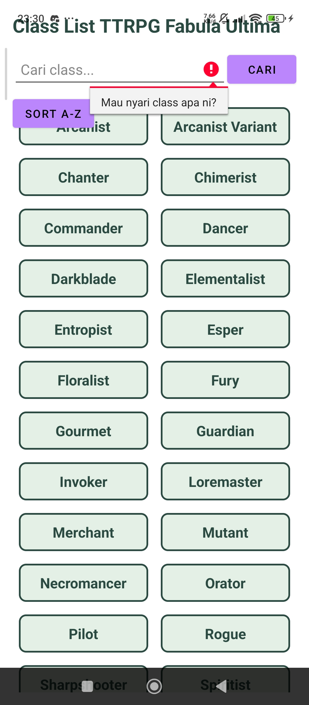
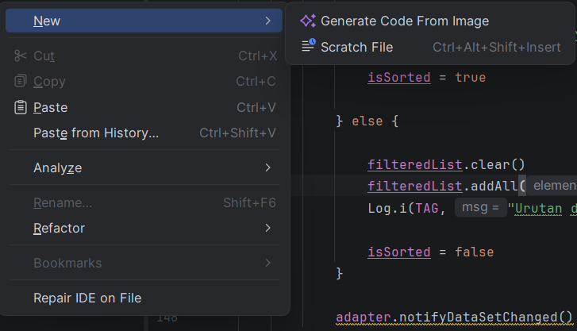

# UAS Pemrograman Seluler - Katalog Class dan Skill TTRPG Fabula Ultima

## Informasi Mahasiswa

* **Nama** : Evan Safi Maulana Malik Ibrahim
* **NIM**  : 42430019

---

## Topik Aplikasi
Aplikasi **Katalog Class dan Skill TTRPG Fabula Ultima** adalah aplikasi untuk mencari class dan skills yang ada di buku besar TTRPG Fabula Ultima. Dengan fitur yang memungkinkan pengguna untuk :
1. Mencari class dan skill di Fabula Ultima tanpa harus mencari di buku besar nya langsung.
2. Mencari class tertentu berdasarkan nama.
3. Mengurutkan daftar bahasa secara alfabetis (A-Z).
4. Melihat informasi skill di setiap class.

---

# Screenshot Aplikasi

## 1. Layout Portrait
| Mode Portrait Homepage | Mode Portrait Detail |
| :---: | :---: |
|  |  |

---

## 2. Layout Landscape
| Mode Portrait Homepage | Mode Portrait Detail |
| :---: | :---: |
|  |  |

---

## 3. Hasil Pencarian Data Class
| :---: |

---

## 4. Hasil Pengurutan Data Class
| :---: |

---

## 5. Verifikasi Logcat beserta NIM

| Logcat - NIM (42430025) |
| :---: |

